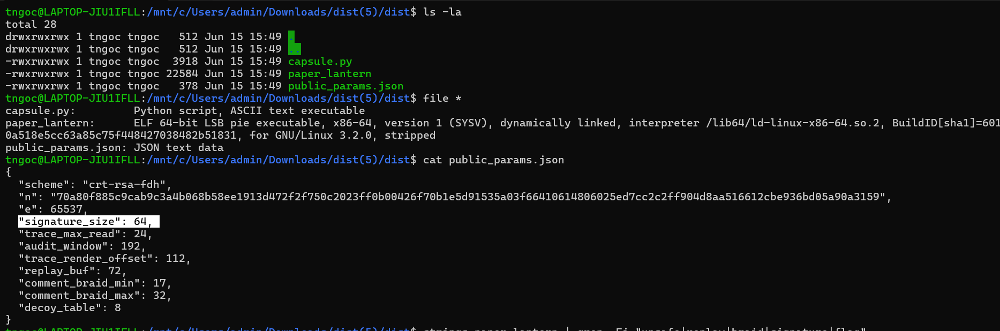
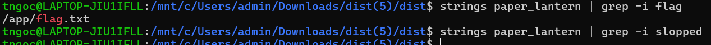
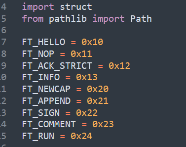
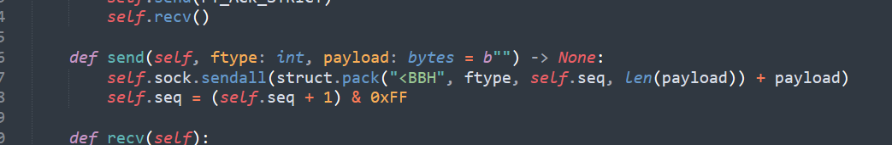
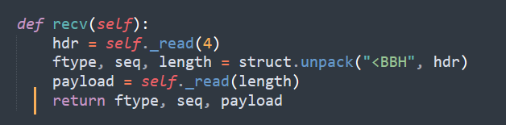
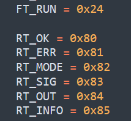
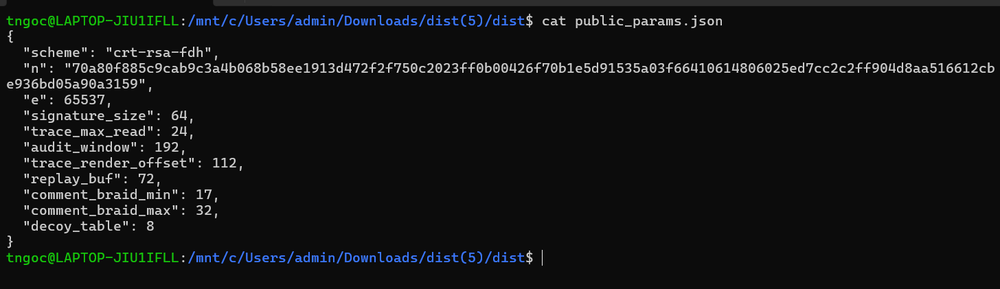
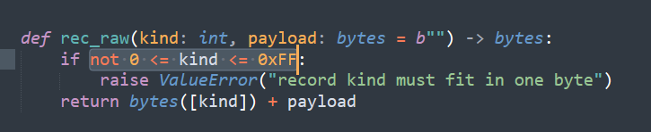
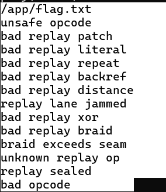

# Paper Lantern

## 1. Thông tin bài

- **Category:** Pwn
- **Challenge:** Paper Lantern
- **Target:** `178.105.199.41:20000`
- **Bug chính:** CRT-RSA fault attack
- **Kết quả:** Solved

## Recon ban đầu

Đầu tiên, mình kiểm tra nhanh thư mục challenge để xem bài cung cấp những file gì:

```bash
ls -la
````


Kết quả cho thấy challenge có ba file chính:

* Một file binary `paper_lantern`
* Một file Python
* Một file JSON

Đây là dấu hiệu khá quen thuộc trong các bài CTF dạng Pwn/Crypto: binary thường là chương trình chính của challenge, file Python có thể là helper hoặc client mẫu, còn file JSON thường chứa dữ liệu cấu hình, public key, capsule mẫu hoặc signature mẫu.

Tiếp theo, mình kiểm tra loại file của binary:

```bash
file paper_lantern
```

Kết quả cho thấy `paper_lantern` là một file ELF binary và đã bị **strip**. Điều này có nghĩa là các symbol debug như tên hàm, tên biến đã bị xóa, khiến việc reverse trực tiếp binary khó hơn vì ta không còn các tên hàm rõ ràng để bám theo.

Sau đó, mình đọc thử các file text đi kèm:

```bash
cat *.json
cat *.py
```

Khi xem nội dung, chi tiết đầu tiên khiến mình chú ý là phần **signature** có độ dài **64 bytes**.

Đây là một manh mối quan trọng. Signature 64 bytes tương ứng với một giá trị có kích thước 512-bit. Trong bối cảnh bài có cơ chế ký/xác thực capsule, điều này khiến mình nghi ngờ challenge đang sử dụng một dạng RSA nhỏ hoặc một cơ chế chữ ký có liên quan đến số nguyên lớn.

Vì binary đã bị strip nên mình không đi thẳng vào reverse toàn bộ chương trình ngay. Thay vào đó, mình bắt đầu từ file JSON trước, vì JSON thường chứa các tham số dễ đọc hơn như public key, modulus, exponent, message mẫu hoặc signature mẫu.

Hướng suy nghĩ lúc này là:

```text
Có signature 64 bytes
        ↓
Khả năng cao liên quan đến RSA hoặc cơ chế ký số
        ↓
Cần xem JSON để tìm public parameters
        ↓
Sau đó mới quay lại binary để hiểu service kiểm tra chữ ký như thế nào
```

Tóm lại, ở bước recon ban đầu, mình xác định được ba điểm quan trọng:

1. Challenge có binary chính `paper_lantern`.
2. Binary đã bị strip nên reverse trực tiếp sẽ khó hơn.
3. File JSON chứa signature 64 bytes, đây là manh mối mạnh cho hướng phân tích signature.


---
## Kiểm tra string trong binary

Sau khi biết paper_lantern là một binary đã bị strip, mình tiếp tục kiểm tra nhanh các chuỗi có trong file bằng strings.

Vì format flag của giải là slopped{...}, mình thử tìm trực tiếp các keyword thường gặp như flag và slopped:
```text
strings paper_lantern | grep -i flag
strings paper_lantern | grep -i slopped
```
Kết quả là không có output đáng chú ý:



Đây là một bước recon nhỏ nhưng khá quan trọng. Nó giúp loại bỏ hướng đi đơn giản là tìm flag trong file local, đồng thời xác nhận rằng bài này cần khai thác logic hoặc crypto để bắt server trả flag.

---

## 3. Đọc file Python và nhận ra service dùng protocol riêng

Sau khi không tìm thấy flag trực tiếp trong binary, mình chuyển sang đọc file Python đi kèm. Ở đây có một đoạn khai báo các hằng số frame type:



```python
FT_HELLO      = 0x10
FT_NOP        = 0x11
FT_ACK_STRICT = 0x12
FT_INFO       = 0x13

FT_NEWCAP     = 0x20
FT_APPEND     = 0x21
FT_SIGN       = 0x22
FT_COMMENT    = 0x23
FT_RUN        = 0x24
```

Ban đầu nhìn vào các tên này mình thấy khá lạ, vì nếu là một bài pwn đơn giản thì chương trình thường sẽ có kiểu nhập menu, nhập text, nhập option như:

```text
1. Create
2. Edit
3. Delete
4. Print flag
```

Nhưng ở đây các tên biến lại giống như các loại message trong một protocol riêng. Đọc sơ qua có thể đoán ý nghĩa như sau:

- `FT_HELLO`: bắt tay với server.
- `FT_NOP`: frame không làm gì, thường dùng để test kết nối.
- `FT_ACK_STRICT`: bật hoặc xác nhận một chế độ kiểm tra chặt hơn.
- `FT_INFO`: lấy thông tin từ server.
- `FT_NEWCAP`: tạo một capsule mới.
- `FT_APPEND`: thêm dữ liệu vào capsule.
- `FT_SIGN`: xin chữ ký cho capsule.
- `FT_COMMENT`: gửi comment hoặc metadata.
- `FT_RUN`: chạy capsule.

Từ các tên này, mình hiểu rằng bài không hoạt động theo kiểu nhập một chuỗi rồi làm crash chương trình để in flag. Thay vào đó, client phải gửi từng frame đúng format để nói chuyện với server.

Nói cách khác, bài này có một protocol riêng:

```text
Client gửi frame
        ↓
Server đọc frame type
        ↓
Server xử lý theo từng loại frame
        ↓
Server trả response
```

Các frame quan trọng nhất lúc này là:

```text
FT_NEWCAP  → tạo capsule
FT_APPEND  → ghi dữ liệu vào capsule
FT_SIGN    → xin chữ ký
FT_RUN     → chạy capsule
```

Điều này làm thay đổi hướng suy nghĩ ban đầu của mình. Flag đúng là nằm trên server, nhưng không phải chỉ cần nhập một đoạn text đặc biệt là server sẽ in flag. Muốn lấy flag thì phải hiểu được:

1. Format frame gửi lên server là gì.
2. Capsule được tạo và lưu như thế nào.
3. Signature được dùng để kiểm tra capsule ra sao.
4. Điều kiện nào khiến `FT_RUN` chạy được capsule chứa opcode lấy flag.

Tại thời điểm này, mình bắt đầu nghi ngờ cơ chế chính của bài nằm ở luồng:

```text
Tạo capsule
    ↓
Append dữ liệu
    ↓
Xin chữ ký
    ↓
Sửa hoặc forge capsule
    ↓
Run capsule để lấy flag
```
Đây cũng là lý do mình chuyển trọng tâm từ việc tìm lỗi nhập liệu thông thường sang phân tích protocol và cơ chế ký/xác thực capsule.

## 4. Xác định format frame của protocol

Khi đọc tiếp file Python, mình thấy hàm `send()` như sau:



```python
def send(self, ftype: int, payload: bytes = b"") -> None:
    self.sock.sendall(struct.pack("<BBH", ftype, self.seq, len(payload)) + payload)
    self.seq = (self.seq + 1) & 0xFF
```

Đây là một đoạn rất quan trọng, vì nó gần như mô tả trực tiếp format mà client phải gửi cho server.

Nhìn vào dòng:

```python
struct.pack("<BBH", ftype, self.seq, len(payload))
```

ta có thể hiểu frame header gồm:

```text
1 byte  ftype
1 byte  seq
2 bytes length
payload
```

Trong đó:

- `ftype`: loại frame, ví dụ `FT_SIGN`, `FT_RUN`, `FT_APPEND`.
- `seq`: sequence number, tăng dần sau mỗi lần gửi.
- `length`: độ dài của payload.
- `payload`: dữ liệu thật sự gửi kèm theo frame.

Ký hiệu `"<BBH"` trong `struct.pack` có nghĩa là:

```text
<  : little-endian
B  : unsigned char, 1 byte
B  : unsigned char, 1 byte
H  : unsigned short, 2 bytes
```

Vì vậy header có tổng cộng 4 bytes:

```text
ftype | seq | length_low | length_high
```

Ví dụ, nếu mình gửi frame `FT_SIGN = 0x22` với payload rỗng, giả sử sequence hiện tại là `0x03`, thì dữ liệu gửi đi sẽ là:

```text
22 03 00 00
```

Giải thích:

```text
22      = frame type FT_SIGN
03      = sequence number
00 00   = payload length = 0
```

Nếu payload không rỗng, ví dụ payload dài 5 bytes, header sẽ có dạng:

```text
22 03 05 00
```

và sau đó nối thêm 5 bytes payload phía sau.

Từ đây mình hiểu rằng bài này không nhận input theo kiểu text thông thường. Server đang đọc dữ liệu theo một frame format cố định. Nếu gửi sai header, sai sequence hoặc sai length thì server có thể không xử lý đúng request.

Luồng giao tiếp cơ bản sẽ giống như sau:

```text
Client
  |
  |-- frame: FT_HELLO
  |
Server
  |
  |-- response
  |
Client
  |
  |-- frame: FT_NEWCAP
  |
  |-- frame: FT_APPEND + payload
  |
  |-- frame: FT_SIGN
  |
  |-- frame: FT_RUN
```

Điểm quan trọng của bước này là mình đã xác định được cách nói chuyện với service. Thay vì thử nhập linh tinh bằng `nc`, mình cần viết client gửi đúng binary frame theo format:

```text
[ftype:1][seq:1][length:2][payload:length]
```

Đây là nền tảng để các bước sau có thể xin chữ ký, tạo capsule và cuối cùng forge payload để chạy opcode lấy flag.

---

## 5. Phân tích hàm `recv()` và response frame

Sau khi hiểu cách client gửi frame qua hàm `send()`, mình tiếp tục lướt xuống hàm kế bên là `recv()`:



```python
def recv(self):
    hdr = self._read(4)
    ftype, seq, length = struct.unpack("<BBH", hdr)
    payload = self._read(length)
    return ftype, seq, payload
```

Đoạn này xác nhận rằng server cũng phản hồi theo cùng một kiểu protocol frame.

Điểm đáng chú ý là hàm `recv()` ban đầu chỉ đọc đúng **4 bytes header**:

```python
hdr = self._read(4)
```

Sau đó mới parse header bằng:

```python
ftype, seq, length = struct.unpack("<BBH", hdr)
```

Tức là response header cũng có format:

```text
1 byte  ftype
1 byte  seq
2 bytes length
```

Sau khi biết `length`, client mới đọc tiếp phần payload:

```python
payload = self._read(length)
```

Vậy format response đầy đủ là:

```text
[ftype:1][seq:1][length:2][payload:length]
```

Điều này giống với format frame lúc gửi đi. Nghĩa là cả client và server đều giao tiếp bằng protocol nhị phân riêng, không phải text protocol.

Ở phía dưới file Python còn có các response type:



```python
RT_OK   = 0x80
RT_ERR  = 0x81
RT_MODE = 0x82
RT_SIG  = 0x83
RT_OUT  = 0x84
RT_INFO = 0x85
```

Mình hiểu sơ bộ ý nghĩa của các response này như sau:

- `RT_OK = 0x80`: server xử lý thành công.
- `RT_ERR = 0x81`: server trả lỗi.
- `RT_MODE = 0x82`: server trả thông tin về mode hoặc trạng thái.
- `RT_SIG = 0x83`: server trả signature.
- `RT_OUT = 0x84`: server trả output sau khi chạy capsule.
- `RT_INFO = 0x85`: server trả thông tin cấu hình hoặc public parameter.

Tới đây, mình xác định được cả hai chiều giao tiếp:

```text
Client request:
[FT_*][seq][length][payload]

Server response:
[RT_*][seq][length][payload]
```

Ví dụ, khi client gửi `FT_SIGN` để xin chữ ký, nếu hợp lệ thì server có thể trả về response dạng `RT_SIG` kèm payload là signature.

Luồng này có thể hình dung như sau:

```text
Client gửi FT_SIGN
        ↓
Server xử lý capsule hiện tại
        ↓
Server ký dữ liệu
        ↓
Server trả RT_SIG + signature
```

Điểm quan trọng ở bước này là mình đã hiểu rằng muốn khai thác bài này thì cần làm đúng protocol ở cả hai phía:

1. Gửi đúng frame type.
2. Gửi đúng sequence.
3. Gửi đúng length.
4. Parse đúng response type.
5. Đọc đúng payload server trả về.

Vì vậy hướng nhập text thủ công bằng `nc` gần như không phù hợp. Bài này cần viết script client để gửi và nhận frame đúng format.

Sau bước này, mình bắt đầu tập trung vào những frame quan trọng nhất:

```text
FT_NEWCAP   → tạo capsule mới
FT_APPEND   → thêm nội dung vào capsule
FT_SIGN     → xin chữ ký
FT_RUN      → chạy capsule

RT_SIG      → nhận chữ ký từ server
RT_OUT      → nhận output sau khi chạy capsule
RT_ERR      → debug lỗi nếu gửi sai
```

Đây là nền để tiếp tục phân tích cơ chế capsule và signature ở các bước sau.

## 6. Phân tích `public_params.json` và nghi ngờ RSA-CRT

Sau khi hiểu sơ bộ protocol frame, mình quay lại đọc kỹ file `public_params.json`:

```bash
cat public_params.json
```

Output:



```json
{
  "scheme": "crt-rsa-fdh",
  "n": "70a80f885c9cab9c3a4b068b58ee1913d472f2f750c2023ff0b00426f70b1e5d91535a03f66410614806025ed7cc2c2ff904d8aa516612cb0936bd05a90a3159",
  "e": 65537,
  "signature_size": 64,
  "trace_max_read": 24,
  "audit_window": 192,
  "trace_render_offset": 112,
  "replay_buf": 72,
  "comment_braid_min": 17,
  "comment_braid_max": 32,
  "decoy_table": 8
}
```

Dòng đầu tiên rất đáng chú ý:

```json
"scheme": "crt-rsa-fdh"
```

Ở đây có thể tách thành hai phần:

```text
crt-rsa-fdh
│   │   │
│   │   └── FDH = Full Domain Hash
│   └────── RSA signature
└────────── CRT optimization
```

Điều này cho thấy bài đang dùng **RSA signature** để xác thực dữ liệu. Cụ thể hơn, đây là RSA dùng CRT để tối ưu tốc độ ký.

Trong RSA, public key thường có dạng:

```text
public key = (n, e)
```

Trong file JSON, ta thấy:

```json
"e": 65537
```

`65537` là public exponent rất phổ biến trong RSA.

Ta cũng có modulus `n`:

```text
n = 70a80f885c9cab9c3a4b068b58ee1913d472f2f750c2023ff0b00426f70b1e5d91535a03f66410614806025ed7cc2c2ff904d8aa516612cb0936bd05a90a3159
```

Về mặt toán học:

```text
n = p * q
```

Nhưng ở thời điểm này, mình chỉ biết `n` và `e`, chưa biết `p`, `q`, cũng chưa biết private key `d`.

Dòng tiếp theo cũng rất quan trọng:

```json
"signature_size": 64
```

Signature dài 64 bytes, tương đương 512-bit. Điều này khớp với kích thước của modulus RSA trong bài.

Tới đây mình có suy nghĩ:

```text
Service dùng RSA signature
        ↓
Muốn chạy capsule có thể cần chữ ký hợp lệ
        ↓
Mình có public key (n, e)
        ↓
Nhưng chưa có private key
        ↓
Cần tìm lỗi để lấy chữ ký hoặc khôi phục private key
```

---

## 7. Chú ý đến `replay_buf`

Trong file JSON còn có một trường khá lạ:

```json
"replay_buf": 72
```

Ban đầu mình chưa biết chính xác `replay_buf` dùng để làm gì. Tuy nhiên, vì đây là một bài Pwn/Crypto nên một buffer size cụ thể như `72` thường là manh mối đáng để chú ý.

Một số hướng nghi ngờ ban đầu của mình là:

```text
replay_buf = 72
        ↓
Có thể liên quan đến buffer xử lý replay
        ↓
Có thể có lỗi boundary check
        ↓
Có thể có overflow / off-by-one / state corruption
```

Ngoài ra, các trường như:

```json
"trace_render_offset": 112,
"audit_window": 192
```

cũng gợi ý rằng chương trình có nhiều vùng dữ liệu nội bộ liên quan đến trace, audit hoặc replay. Vì vậy mình tạm ghi chú lại các giá trị này để quay lại sau khi hiểu rõ hơn về format capsule.

---

## 8. Hiểu sơ bộ khái niệm capsule

Trong file Python, mình thấy có hàm tạo record dạng raw:



```python
def rec_raw(kind: int, payload: bytes = b"") -> bytes:
    if not 0 <= kind <= 0xFF:
        raise ValueError("record kind must fit in one byte")
    return bytes([kind]) + payload
```

Hàm này cho thấy mỗi record bên trong capsule có format rất đơn giản:

```text
[kind:1][payload]
```

Trong đó `kind` chỉ được phép nằm trong khoảng một byte:

```text
0x00 <= kind <= 0xFF
```

Lúc này mình hiểu `capsule` có thể được xem như một container chứa nhiều record nhỏ. Mỗi record có một `kind` riêng, còn payload phía sau sẽ được chương trình xử lý tùy theo loại record đó.

Nói đơn giản:

```text
Capsule
  ├── record 1: kind + payload
  ├── record 2: kind + payload
  └── record 3: kind + payload
```

Điều này làm mình nghĩ rằng muốn chạy được hành vi đặc biệt trên server, ta cần tìm đúng `kind` hoặc opcode mà chương trình hỗ trợ.

---

## 9. Tìm opcode đáng ngờ bằng `strings`

Để kiểm tra lại các chuỗi đáng chú ý trong binary, mình chạy:

```bash
strings paper_lantern
```

Trong output có một số chuỗi rất đáng chú ý:



```text
/app/flag.txt
unsafe opcode
bad replay patch
bad replay literal
bad replay repeat
bad replay backref
bad replay distance
replay lane jammed
bad replay xor
bad replay braid
braid exceeds seam
unknown replay op
replay sealed
bad opcode
```

Ở đây có hai manh mối quan trọng.

Thứ nhất, binary có nhắc tới:

```text
/app/flag.txt
```

Điều này củng cố giả thuyết rằng flag nằm trên remote server tại đường dẫn `/app/flag.txt`, chứ không nằm trong binary local.

Thứ hai, có chuỗi:

```text
unsafe opcode
bad opcode
```

Điều này cho thấy bên trong capsule có tồn tại opcode bị chặn. Nếu gửi opcode không hợp lệ hoặc opcode nhạy cảm, server sẽ từ chối.

Từ đây, mình chuyển sang hướng tìm opcode:

```text
Capsule dùng record kind 1 byte
        ↓
Có lỗi "bad opcode" / "unsafe opcode"
        ↓
Cần tìm opcode nào được chương trình xử lý đặc biệt
        ↓
Nếu opcode đó liên quan đến flag thì cần bypass cơ chế signature
```

---

## 10. Brute force thử record kind / opcode

Vì `rec_raw()` giới hạn `kind` trong một byte, mình thử viết script để test các giá trị opcode trong khoảng `0x00` đến `0xFF`.

Ý tưởng là:

```text
Tạo capsule mới
        ↓
Append record với kind/opcode đang test
        ↓
Gửi SIGN
        ↓
Quan sát response của server
```

Trong quá trình test, mình thấy một payload đáng chú ý là:

```text
7f03
```

Khi gửi payload này bằng frame `FT_APPEND`, server chấp nhận append:

```text
[APPEND] type=0x21 seq=3 len=2 payload=7f03
[after APPEND] type=RT_OK seq=0 len=16
    payload_hex  = 7265636f72647320170656e646564
    payload_text = 'records appended'
```

Nhưng khi xin chữ ký bằng `FT_SIGN`, server trả lỗi:

```text
[SIGN] type=0x22 seq=4 len=0 payload=
[after SIGN] type=RT_ERR seq=0 len=13
    payload_hex  = 756e73616665206f70636f6465
    payload_text = 'unsafe opcode'
```

Đây là phát hiện rất quan trọng.

Nó chứng minh rằng `7f03` không phải payload bình thường. Server nhận ra nó là một opcode nguy hiểm và không cho ký.

Tức là:

```text
Payload 7f03
        ↓
Append được vào capsule
        ↓
Nhưng khi SIGN thì bị chặn
        ↓
Server báo "unsafe opcode"
```

Lúc này mình hiểu rằng hướng đi đúng không phải là xin server ký trực tiếp payload này. Vì cơ chế kiểm tra của server đã phát hiện đây là unsafe opcode.

Thay vào đó, ta cần một cách khác để có chữ ký hợp lệ cho capsule chứa unsafe opcode.

---

## 11. Kết luận sau bước opcode recon

Tới đây, mình có các kết luận quan trọng:

1. Service dùng RSA signature theo scheme `crt-rsa-fdh`.
2. Public key có dạng `(n, e)` với `e = 65537`.
3. Signature dài 64 bytes, khớp RSA 512-bit.
4. Capsule có các record dạng `kind + payload`.
5. Binary có nhắc tới `/app/flag.txt`, `unsafe opcode`, `bad opcode`.
6. Payload `7f03` bị server nhận diện là `unsafe opcode`.
7. Server không cho ký trực tiếp capsule chứa opcode này.

Do đó, bài toán chuyển thành:

```text
Làm sao tạo chữ ký hợp lệ cho capsule chứa unsafe opcode 7f03
nếu server không chịu ký trực tiếp capsule đó?
```

Đây là điểm nối sang phần khai thác RSA-CRT ở bước sau.

Script dùng để test bước này:

[01_test_safe_signature.py](./scripts/1.py)


## 16. Scripts

Mình tách exploit thành 3 script để dễ debug từng giai đoạn.

| Script | Mục đích |
|---|---|
| [`01_test_safe_signature.py`](./scripts/test.py) | Test protocol, handshake, tạo safe capsule và xin chữ ký hợp lệ |
| [`02_factor_rsa_from_fault.py`](./scripts/factor.py) | Gây CRT fault, tính GCD, recover `p`, `q`, `d` |
| [`03_solve_forge_unsafe_opcode.py`](./scripts/solve.py) | Dùng private key để ký opcode `0x7f` và lấy flag |

---

## 18. Flag

```text
slopped{faulted_crt_seams_burn_open}
```

---

##

Mấu chốt bài này không phải là buffer overflow thông thường.

Mấu chốt là:

```text
comment và replay buffer overflow
-> gây lỗi RSA-CRT signing
-> lấy faulty signature
-> dùng GCD tính n
-> tính private key d
-> forge signature cho unsafe opcode
-> chạy opcode 0x7f lấy flag
```

---

